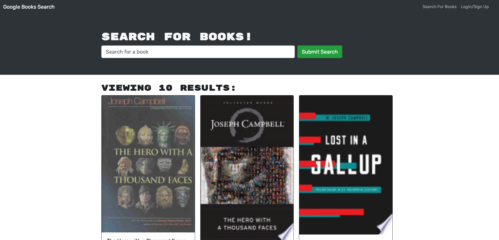

# Book Search Engine

## Description 

The Book Search Engine is a Google Books API search engine using the MERN Stack. Here You can search books online. the user is allowed  sign up and sign in to save books to the reading wish list and remove them when they're ready to remove them. 

once loading the search engine, you will shortly after be presented with a menu with the options to not only  Search for Books but Login/Signup and a input field to search for books and a submit button. 

 click on the Search for Books menu option and you'll be presented with an input field to search for books and a submit button. If you are already logged in you can enter in a search term in the input field, then click the submit button where you'll presented with several search results. Each result  featuring a book’s title, author, description, image, and a link to that book on the Google Books site. Then the user can then click on the Login/Signup menu option and a modal will then appear on the screen with a toggle between the option to log in or sign up. 

when finally  logged in,  menu options change to Search for Books, a option to see your saved books, and Logout. 

## Table of Contents

* [Installation](#installation)
* [License](#License) 
* [Contributing](#Contributing)
* [Tests](#Tests) 
* [Languages and Dependencies](#Languages) 

## Installation

To install, First simply clone the app and git init the json packages. when running node, on node, you run the script 'npm start' on your terminal, then program will take you directly to the site using graphQL. 

---
## License
none

## Contributing

Other may contribute by requesting to contribute through GitHub, cloning the code and creating separate branches. All final code will be reviewed and approved if changes are favorable.

## Tests

N.A.

## Languages and Dependencies

JavaScript, ES6, Node.js, Apollo, Server, Express, React, Bootstrap

## For More Information

* fabianjammalingram@gmail.com
* [Link to Repo](https://github.com/fabianingram
* [Link to Live Site](https://tranquil-ravine-07521.herokuapp.com/)

